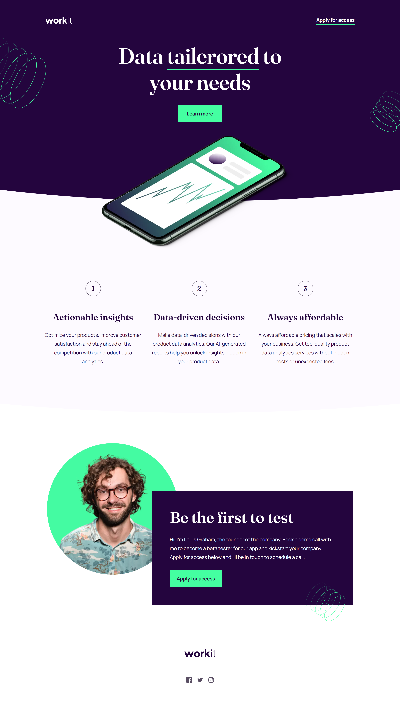
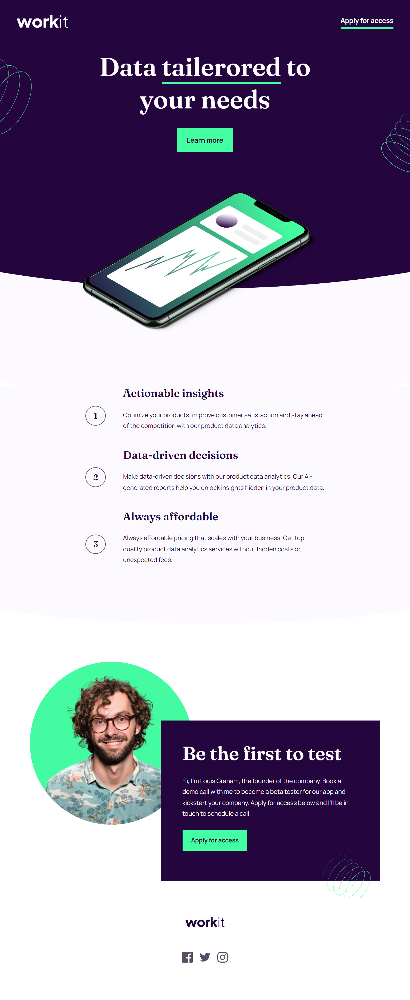
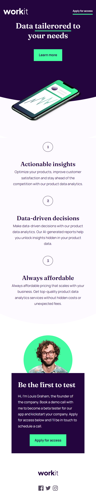

# Frontend Mentor - Workit landing page solution

This is a solution to the [Workit landing page challenge on Frontend Mentor](https://www.frontendmentor.io/challenges/workit-landing-page-2fYnyle5lu). Frontend Mentor challenges help you improve your coding skills by building realistic projects. 

## Table of contents

- [Overview](#overview)
  - [The challenge](#the-challenge)
  - [Screenshot](#screenshot)
  - [Links](#links)
- [My process](#my-process)
  - [Built with](#built-with)
  - [What I learned](#what-i-learned)
- [Author](#author)

## Overview

### The challenge

Users should be able to:

- View the optimal layout for the interface depending on their device's screen size
- See hover and focus states for all interactive elements on the page

### Screenshot





### Links

- Solution URL: (https://github.com/mikatechs/workit-landing-page)
- Live Site URL:(https://mikatechs.github.io/workit-landing-page/)

## My process

### Built with

- Semantic HTML5 markup
- CSS custom properties
- Flexbox
- CSS Grid
- Desktop-first workflow

### What I learned

Creating oval bottom background with ::before pseudo element is the trick in this challege.

```css
 &::before {
        content: '';
        position: absolute;
        top: 0;
        right: 0;
        width: 100%;
        height: 73rem;
        background-color: $color-primary-bg;
        clip-path: ellipse(150% 100% at 50% 0%);
        z-index: -1;
}
```
## Author

- Website - [Mika Varshanidze](https://github.com/mikatechs/)
- Frontend Mentor - [@mikatechs](https://www.frontendmentor.io/profile/mikatechs)
